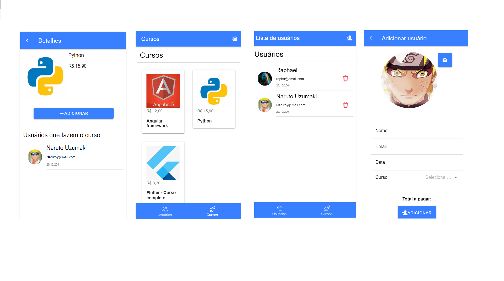

# Cadastro de usuários e cursos - Angular/Ionic

## Bibliotecas e metodologias usadas

1) Ngrx (Redux para angular)
2) localStorageSync - Redux com local Storage
3) Atomic Design

## Plugins (Capacitor)

1) @capacitor/camera - [ver](https://capacitorjs.com/docs/apis/camera)

## Screenshots
